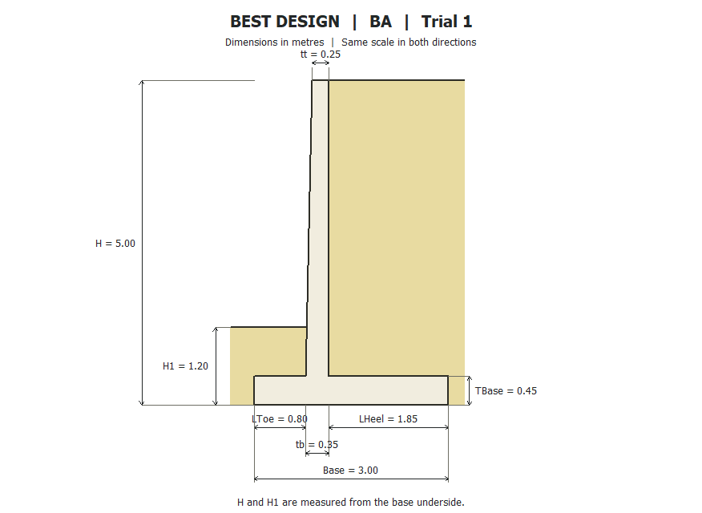

# ป๊อปอัปรูปทรงคำตอบที่ดีที่สุด

เพิ่มฟอร์ม VB6 `frmBestDesign.frm` หนึ่งฟอร์ม เปิดอัตโนมัติหลังปุ่ม BA หรือ HCA ทำงานครบทุก trial และสรุปคำตอบดีที่สุดแล้ว ใช้ `bestDesign` ของทั้งรอบ ไม่ใช้คำตอบของ trial สุดท้าย

ภาพแสดงรูปกำแพงหน้าสอบ ดินสีเหลืองอ่อน คอนกรีตสีครีม และมิติ H, H1, tt, tb, TBase, Base, LToe, LHeel หน่วยเมตร ใช้มาตราส่วนแนวตั้งและแนวนอนเท่ากัน H/H1 วัดจากท้องฐาน ไม่ใส่เหล็กหรือแรงดันดินในภาพตามขอบเขตที่ขอ ค่า tt แสดงหลักทศนิยมที่สามเมื่อจำเป็น เช่น .525 ม. ของ HCA

ปิดด้วย Close, Enter, Esc หรือ X ได้ เป็นหน้าต่างลูกที่ยังอนุญาตให้กลับไปดูผลหลักได้ ถ้าไม่พบคำตอบจะแสดง NO_SOLUTION และล้างรูปเก่า ไม่วาดมิติที่เป็นศูนย์หรือไม่ถูกต้อง เมื่อปิดโปรแกรมหลัก หน้าต่างรูปปิดด้วย

## โค้ด

- `Form1.frm`: เพิ่มคำสั่งเปิดรูปท้าย BA/HCA และปิดหน้าต่างลูกเมื่อปิดโปรแกรม
- `frmBestDesign.frm`: รับคำตอบ → ตรวจมิติสำหรับวาด → วาดหน้าตัด → ใส่มิติ ใช้ PictureBox/Line ของ VB6 ไม่มีไลบรารีกราฟิกเพิ่ม ไม่มี Rnd และไม่แก้ข้อมูลคำตอบ
- `RC_RT_HCA_v2.vbp`: ลงทะเบียนฟอร์มใหม่

ไม่มีการแก้โมดูลสูตรวิศวกรรม ราคา BA หรือ HCA ในการเพิ่มรูปครั้งนี้ เปิด `.vbp` ตัวเดิมแล้ว F5 ใช้งานได้

## หลักฐาน VB6 จริง

[ผลทดสอบรูป](sketch-checks/20260908-234002-212/sketch-regression.txt): **17 checks, failures=0** รวม H3/H4/H5, NO_SOLUTION, มิติผิด, ปิดหน้าต่าง และยืนยันว่าไม่เปลี่ยนลำดับเลขสุ่มของ optimizer

ทดสอบปุ่ม BA และ HCA จริงอย่างละ 2 trials × 64 evaluations ด้วย seed 20260908–20260909 ทั้งสองวิธีได้ผู้ชนะ **trial 1 ขณะที่ trial สุดท้ายคือ 2** รูปใช้มิติตรงกับ run.txt ของผู้ชนะ ตรวจจาก trial-summary.csv แยกจากค่าคำตอบสุดท้ายของ optimizer

ภาพ PNG แปลงแบบไม่สูญเสียข้อมูลจาก `PictureBox.Image` ที่ VB6 บันทึกผ่าน SavePicture ไม่ใช่ภาพที่วาดซ้ำด้วย Python ตรวจภาพ BA/HCA และสถานะไม่พบคำตอบแล้ว: มิติอ่านได้ ไม่มีข้อความ H1 ทับเส้นมิติ H

คอมไพล์โปรเจกต์หลักสำเร็จและทดสอบสูตรเดิมซ้ำ: 267 checks, GUI failures=0; production 47 checks, failures=0 และคำนวณอิสระ 300 ค่าตรงกัน ดู [หลักฐาน production](project-checks/20260908-233942-651/project-regression.txt) และ [compile log](checks/20260908-233942-932/compile-RC_RT_HCA_v2.log)

**ไม่ได้รัน 30 trials** ของผู้ใช้ ทดสอบรูปซ้ำได้ด้วย `powershell -NoProfile -ExecutionPolicy Bypass -File audit\run_sketch_checks.ps1` บนเครื่องนี้ที่มี VB6 และ Python/Pillow สำหรับแปลงรูปหลักฐาน
