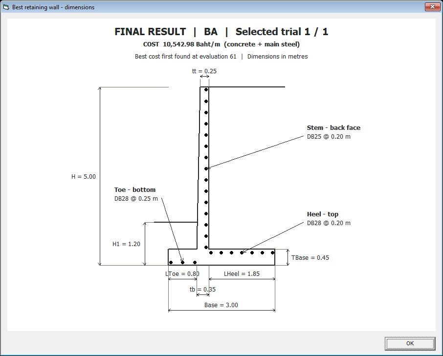

# ป๊อปอัปรูปทรงคำตอบที่ดีที่สุด

เพิ่มฟอร์ม VB6 `frmBestDesign.frm` หนึ่งฟอร์ม เปิดอัตโนมัติหลังปุ่ม BA หรือ HCA ทำงานครบทุก trial และสรุปคำตอบดีที่สุดแล้ว ใช้ `bestDesign` ของทั้งรอบ ไม่ใช้คำตอบของ trial สุดท้าย

**แสดงเพียงครั้งเดียวหลังจบรอบทั้งหมด** ถ้าตั้ง Trials=30 จะรอครบ 30 ครั้งก่อนเปิดภาพ และปิดภาพของรอบเก่าเมื่อเริ่มรอบใหม่ หัวภาพระบุ `FINAL RESULT`, BA/HCA, `Selected trial n / 30` และ evaluation ที่พบราคาดีที่สุดครั้งแรก

การเลือกคำตอบคงลำดับเดิม: ผ่านตัวตรวจ → ราคาต่ำสุดจากทุก trial → หากราคาเท่ากัน เลือก trial ที่พบราคานั้นด้วย evaluations น้อยกว่า ถ้าทั้งราคาและ evaluation เท่ากันจะคง trial ก่อนหน้า คำว่าเร็วในที่นี้หมายถึงจำนวน evaluations ถึงราคาดีที่สุด ไม่ใช่เวลารันจริงหรือการรับประกันการลู่เข้าสู่ global optimum

ภาพรุ่นปัจจุบันแสดงเป็นเส้นรูปกำแพงและเส้นระดับดิน **ไม่มีสีถมดินหรือคอนกรีต และไม่มีแรงดันดิน** ใส่มิติ H, H1, tt, tb, TBase, Base, LToe, LHeel หน่วยเมตร ใช้มาตราส่วนแนวตั้งและแนวนอนเท่ากัน H/H1 วัดจากท้องฐาน ตัวเลขมิติและระยะเรียงแสดงทศนิยม 2 ตำแหน่งตามคำขอ ค่าคำนวณต้นฉบับไม่ถูกปัดแก้

แสดงสัญลักษณ์วงกลมทึบของเหล็กหลัก stem ด้านหลัง, toe ด้านล่าง และ heel ด้านบน พร้อมลูกศรชี้และป้าย DB/ระยะเรียงจากคำตอบจริง ตำแหน่งแกนเหล็กห่างผิวคอนกรีตตาม cover+db/2 โดยใช้ cover ที่ผู้ใช้ป้อน วงกลมเป็นภาพสัญลักษณ์ของชั้นหลัก จำนวนวงกลมในภาพไม่ใช้ถอดปริมาณหรือเพิ่มเหล็กอีกทิศ ระยะเรียงที่ป้ายคือระยะตามแนวยาวกำแพง ไม่ได้วาดเหล็กประกอบหรือระยะฝัง/ทาบ

หัวภาพแสดง **BA หรือ HCA, หมายเลข trial ผู้ชนะ/จำนวน trials, evaluation แรกที่พบราคานั้น และราคาคอนกรีต+เหล็กหลักต่อเมตร** ส่งค่าจากผลสรุป Form1 เข้าฟอร์มโดยตรง ไม่คำนวณราคาใหม่ในโค้ดวาดภาพ ภาพ fixture ที่ไม่ได้ส่งราคาจะระบุว่าไม่ได้ให้ราคา

ปิดด้วยปุ่ม OK, Enter, Esc หรือ X ได้ และลบข้อความอธิบายท้ายภาพตามคำขอแล้ว เป็นหน้าต่างลูกที่ยังอนุญาตให้กลับไปดูผลหลักได้ ถ้าไม่พบคำตอบจะแสดง NO_SOLUTION และล้างรูปเก่า ไม่วาดมิติที่เป็นศูนย์หรือไม่ถูกต้อง เมื่อปิดโปรแกรมหลัก หน้าต่างรูปปิดด้วย

## โค้ด

- `Form1.frm`: ส่งคำตอบและราคาที่ดีที่สุดกับ cover ไปเปิดรูปท้าย BA/HCA และปิดหน้าต่างลูกเมื่อปิดโปรแกรม
- `frmBestDesign.frm`: รับคำตอบ → แสดงราคา/วิธี → วาดหน้าตัด → วาดเหล็กและลูกศร → ใส่มิติ ใช้ PictureBox/Line/Circle ของ VB6 ไม่มีไลบรารีกราฟิกเพิ่ม ไม่มี Rnd และไม่แก้ข้อมูลคำตอบ
- `RC_RT_HCA_v2.vbp`: ลงทะเบียนฟอร์มใหม่

ไม่มีการแก้โมดูลสูตรวิศวกรรม ราคา BA หรือ HCA ในการเพิ่มรูปครั้งนี้ เปิด `.vbp` ตัวเดิมแล้ว F5 ใช้งานได้

## หลักฐาน VB6 จริง

อัปเดต 9 กันยายน 2026: เปลี่ยนเส้นเหล็กเป็นวงกลมทึบ ใช้ตัวเลข 2 ตำแหน่ง ลบ footer และเปลี่ยนปุ่มเป็น OK ทดสอบ [22 checks, failures=0](sketch-checks/20260909-000941-201/sketch-regression.txt) รวมการกด OK, default/cancel สำหรับ Enter/Esc, การมี system Close และส่งคำสั่งเดียวกับกากบาทเพื่อยืนยันว่า unload จริง [คอมไพล์โปรเจกต์หลัก](sketch-checks/20260909-000941-201/compile-main.log) สำเร็จ ตรวจภาพทั้งหน้าต่างด้วยตาแล้ว ปุ่มและกากบาทมองเห็นครบ

ทดลอง BA เพียง 1 trial × 64 evaluations ได้มิติ/เหล็ก/ราคา/evaluation เท่ากับรอบก่อน เปลี่ยนเฉพาะการแสดงผล ไม่ได้รัน 30 trials หรือชุดตรวจวิศวกรรมทั้งหมดซ้ำ เพราะไม่ได้แก้สูตรและ optimizer

`audit/WindowCapture.bas` ใช้เฉพาะ harness เพื่อบันทึกกรอบหน้าต่าง VB6 และทดสอบ system Close ไม่ได้เพิ่มในโปรเจกต์หลัก

หลักฐานก่อนเปลี่ยนสัญลักษณ์เป็นวงกลม: [19 checks, failures=0](sketch-checks/20260908-235048-673/sketch-regression.txt), ใช้ปุ่ม BA จริง **1 trial × 64 evaluations** seed 20260908 พบราคาดีที่สุดของชุดทดสอบที่ evaluation 61 และภาพแสดง Selected trial 1 / 1 ถูกต้อง ตรวจจำนวน trials และ evaluation กับ summary CSV และ [คอมไพล์โปรเจกต์หลักสำเร็จ](sketch-checks/20260908-235048-673/compile-main.log) ตรวจซอร์สทั้ง BA/HCA ว่ามีคำสั่งเปิดภาพเพียงหนึ่งจุดหลัง Next trial ไม่ได้รันชุด 30 ครั้งหรือรัน HCA เพิ่มในรอบนี้

[ผลทดสอบรูปในรอบก่อน](sketch-checks/20260908-234556-842/sketch-regression.txt): **25 checks, failures=0** รวม H3/H4/H5, NO_SOLUTION, มิติผิด, ปิดหน้าต่าง และยืนยันว่าไม่เปลี่ยนลำดับเลขสุ่มของ optimizer เพิ่มการเทียบราคากับ trial-summary.csv และขนาด/ระยะเหล็กทั้งสามส่วนกับรายงานผู้ชนะ

ทดสอบปุ่ม BA และ HCA จริงอย่างละ 2 trials × 64 evaluations ด้วย seed 20260908–20260909 ทั้งสองวิธีได้ผู้ชนะ **trial 1 ขณะที่ trial สุดท้ายคือ 2** รูปใช้มิติตรงกับ run.txt ของผู้ชนะ ตรวจจาก trial-summary.csv แยกจากค่าคำตอบสุดท้ายของ optimizer

ภาพ PNG แปลงแบบไม่สูญเสียข้อมูลจาก `PictureBox.Image` และภาพทั้งหน้าต่างจาก Windows PrintWindow ที่ harness VB6 บันทึกผ่าน SavePicture ไม่ใช่ภาพที่วาดซ้ำด้วย Python ตรวจภาพ BA/HCA และ H3 แล้ว: ไม่มีสีถมดิน ป้ายราคา/มิติ/เหล็กอ่านได้ และลูกศรชี้ชั้นเหล็กหลักตรงตำแหน่ง ตัวเลขราคาในภาพเป็นผลชุดทดสอบสั้น ไม่ใช่ผลวิจัย 30 trials

คอมไพล์โปรเจกต์หลักสำเร็จและทดสอบสูตรเดิมซ้ำ: 267 checks, GUI failures=0; production 47 checks, failures=0 และคำนวณอิสระ 300 ค่าตรงกัน ดู [หลักฐาน production](project-checks/20260908-234640-921/project-regression.txt) และ [compile log](checks/20260908-234641-207/compile-RC_RT_HCA_v2.log)

**ไม่ได้รัน 30 trials** ของผู้ใช้ ทดสอบหนึ่ง trial ซ้ำได้ด้วย `powershell -NoProfile -ExecutionPolicy Bypass -File audit\run_sketch_checks.ps1 -SingleTrial` หากไม่ใส่ -SingleTrial เครื่องมือทดสอบจะใช้ BA/HCA อย่างละ 2 trials ตามชุดทดสอบเดิม ต้องมี VB6 และ Python/Pillow สำหรับแปลงรูปหลักฐาน ค่า Trials เริ่มต้นของโปรแกรมหลักยังเป็น 30
